**Team list:**  Guy S-P, Paul Jebb, John Gardner, Mars Oakley, Sol Rayet, Ash H  
**Date:** 16/12/2024  
**Cohort:** WECA - Full Stack Software Developer: Skills Bootcamp  
**Project:** Tidder: HTML, CSS, Bootstrap, JS, Python, Django  

# **Tidder**

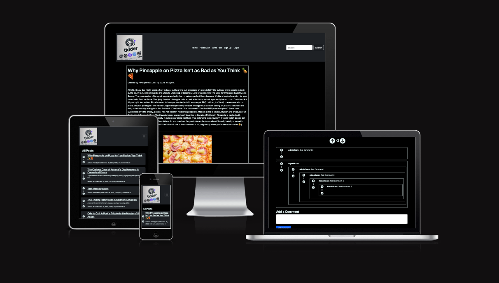

**Tidder** is a social media platform for online communities centered around specific interests and hobbies. It provides a space for users to share ideas, engage in discussions, and collaborate on projects. Whether it's technology, gaming, or a niche hobby, Tidder offers a platform for like-minded individuals to connect and learn from each other.

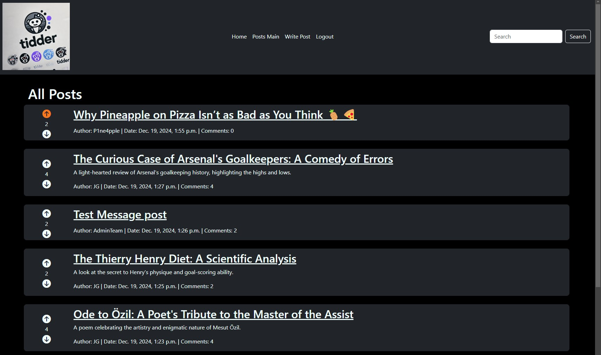

  

## **URL's**

  - **Home Page** https://tidder-8b4ef2cb1495.herokuapp.com/ 
  - **Admin Page** https://tidder-8b4ef2cb1495.herokuapp.com/admin/
  - **Github repository** https://github.com/moakley-45/Tidder-HKTN2
  - **Github project** https://github.com/users/moakley-45/projects/7/views/1

 
 

# Understand the Purpose:

* A platform to create an online community where users can share ideas, engage in discussions, and discover new perspectives.
* To facilitate user interaction through comments and recommendations.
* To provide a user-friendly interface for browsing and contributing content.

  
 

# Project Management Approach

### Agile Methodology
We used an agile methodology. breaking down the project into smaller sprints, giving flexibility as the project progressed.

### GitHub Project Management
As shown below, we used GitHub Projects to track tasks and their progress. Using MoSCoW, Kanban boards and sprints, to prioritise and deliver work.
  

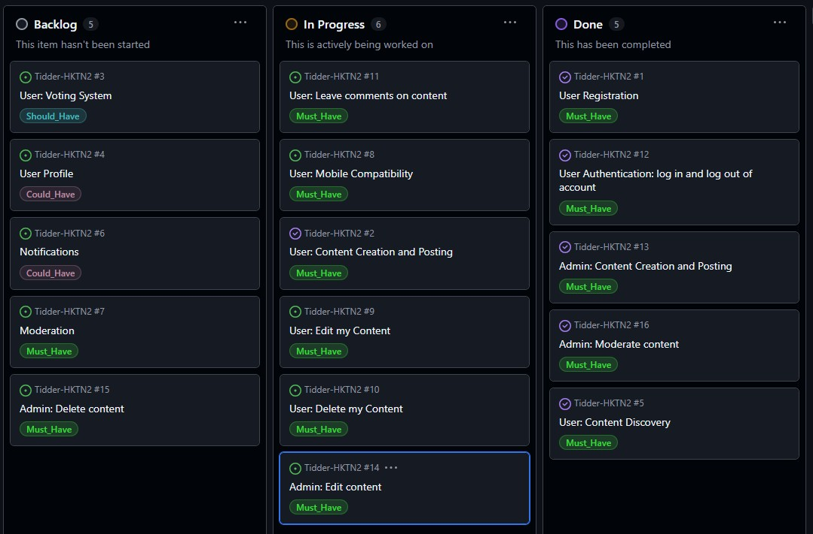

 

### MoSCoW Prioritisation

* **Must-Have:** Core functions for the site basic operation, such as user authentication and blog post management.
* **Should-Have:** Features that enhance user experience.
* **Could-Have:** Additional features to improve the site but are not critical.
* **Won't-Have:** Features that are not prioritised for  development.

### Sprint Planning

* **Sprint 1: Core Functionality**
  * User registration and authentication
  * Blog post creation, editing, and deletion
  * User comment submission and moderation
* **Sprint 2: User Experience and Features**
  * User interface and user experience improvements
* **Sprint 3: Deployment and Testing**
  * Final deployment to production environment
  * Testing for quality and performance
  * Bug fixing

  
  

## Platform Features

* **Home Page**
  * Welcomes visitors and provides a brief overview of the blog's content.
  * Features a list of blog posts.
  * Highlights the latest blog posts.

  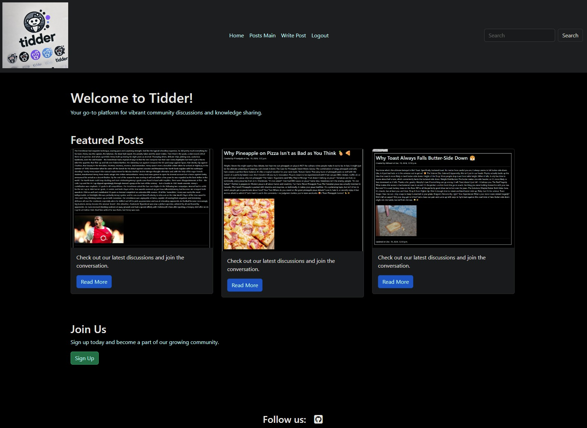

* **Blog Page**
  * Displays a list of blog posts, categorized by topic.
  * Allows users to view individual blog posts in detail.
  * Enables users to leave comments on blog posts.

  

* **Write Post Page**
  * Allows users to write individual blog posts.

  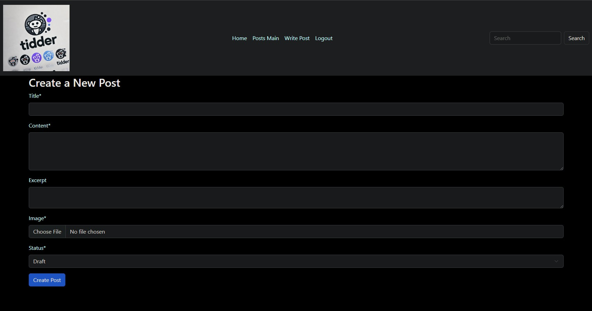

## Target Audience

* Techies: People comfortable navigating online forums and communities.
* Content creators: People who enjoy sharing their knowledge, experiences, and opinions with others.
* Community-oriented users: People who seek to connect with like-minded people and participate in discussions.
* Those seeking diverse perspectives: People who value a wide range of viewpoints and want to engage in open dialogue.

## User Stories

| User Story | MoSCoW | Acceptance Criteria |
|---|---|---|
| User: Register for an account | Must Have | The user should be able to create an account with a unique username and password. |
| User: Log in and log out | Must Have | The user should be able to log in and log out of their account securely. |
| User: Browse subreddits | Must Have | The user should be able to browse a list of Tidders and view their content. |
| User: View posts | Must Have | The user should be able to view individual posts, including their title, content, upvotes, downvotes, and comments. |
| User: Vote on posts | Must Have | The user should be able to upvote or downvote posts. |
| User: Post comments | Must Have | The user should be able to post comments on posts and replies to other comments. |
| User: Edit and delete own posts and comments | Must Have | The user should be able to edit or delete their own posts and comments within a certain timeframe. |
| User: Follow subreddits | Could Have | The user should be able to follow specific Tidders to receive notifications about new posts. |
| User: Save posts for later | Could Have | The user should be able to save posts for later reading. |
| User: Search for content | Should Have | The user should be able to search for posts and comments using keywords. |
| User: Customize user profile | Could Have | The user should be able to customize their profile with an avatar and bio. |
| User: Report abusive or inappropriate content | Must Have | The user should be able to report posts or comments that violate community guidelines.

| Admin User Story | MoSCoW | Acceptance Criteria |
|---|---|---|
| Admin: Create and manage subreddits | Must Have | The admin should be able to create, edit, and delete Tidders. |
| Admin: Moderate user content | Must Have | The admin should be able to remove or edit inappropriate or harmful content. |
| Admin: Manage user accounts | Must Have | The admin should be able to ban or suspend users who violate community guidelines. |
| Admin: Monitor site activity | Must Have | The admin should be able to track user activity, identify trends, and troubleshoot issues.

# Technologies Used

- **HTML5**: Used to create the templates that render the dynamic content generated by Django's views.
- **CSS3**: Used to style templates, creating the visual layout and design of the application.
- **Bootstrap**: Used to accelerate development creating responsive designs that adapt to different screen sizes.
- **Python**: Used to build Django applications. handleing server-side logic, database interactions, and template rendering.
- **JavaScript**: Used to add dynamic behavior to web pages
- **GitHub**: Used to deploy the static files generated by Django.
- **Heroku**:  Used to deploy the Django app managing the infrastructure
- **Balsamiq**: Used for UX wireframes and design

---

# Design Choices

## ERD design:

The Entity-Relationship Diagram for Tidders is designed to model the data of our blog site. This initally helped us understand the data and relationships between fields like Users and Blog Posts. 

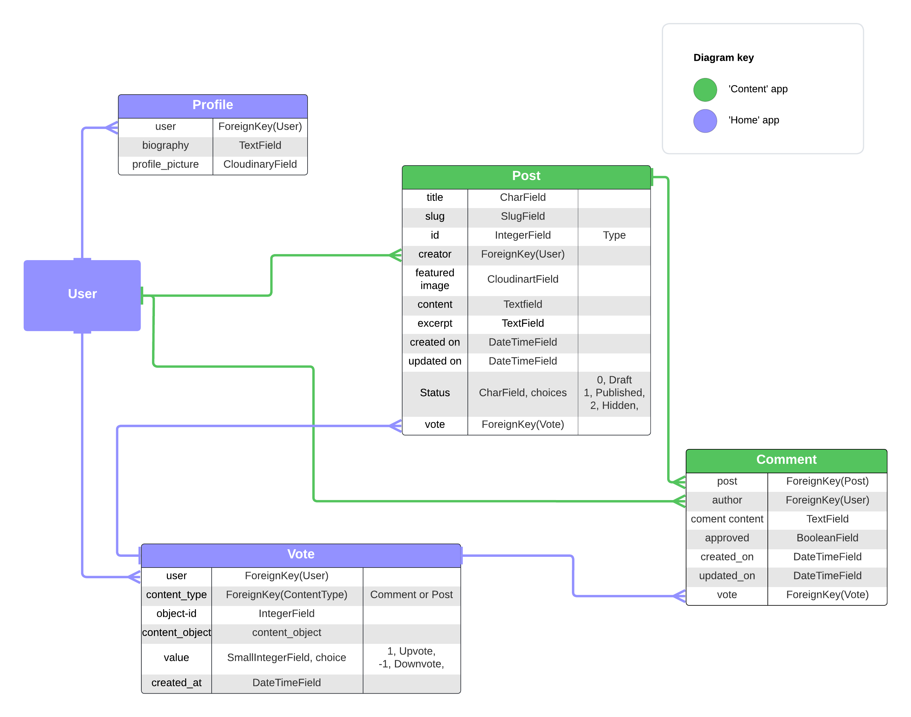

## Color Scheme

- Functional - focus on technical content  

## Fonts

- Standard fonts for readability and consistent design.
- Slightly larger, bold fonts for key information to improve visibility.

## Wireframes

- Wireframes were created to design the Blog layout:  

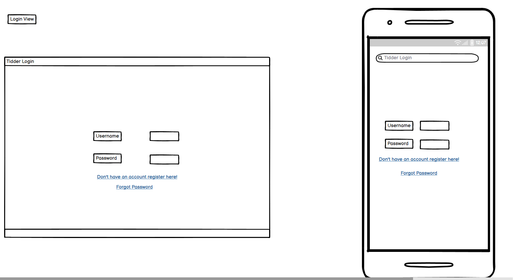

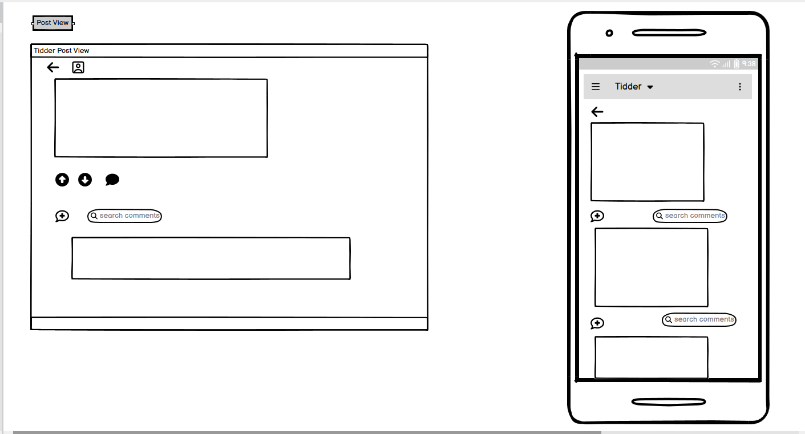

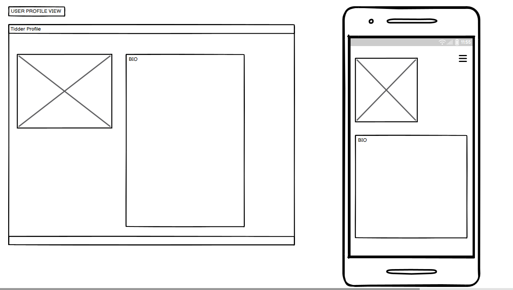

# Testing

The code has been tested and successfully validated though:

### HTML Validation - Status=Passed

- Initial HTML validation was done using the W3C Markup Validation Service. All created code fully passes - only issues were found with Crispy Form's dependent code, which was not created for this project.

 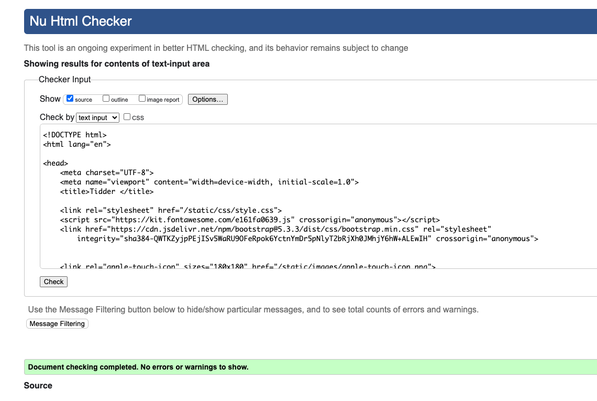

### CSS Validation - Status=Passed

- CSS validation was performed using W3C's CSS Validator.

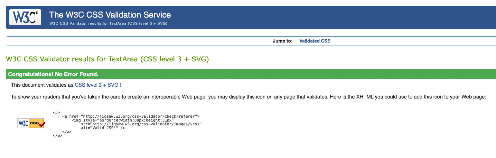

### JS Validation - Status=Passed

- JS validation was perfomed using JSHint.

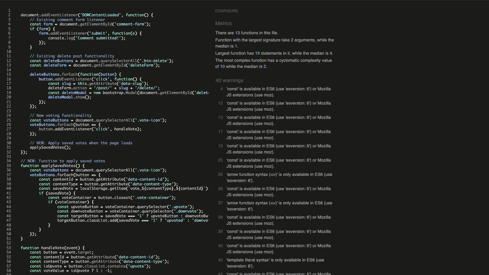

### Python Linter - Status=Passed, 
- We needed to remove added comments to pass validation, as they are lengthy and exceeded 79 chars.

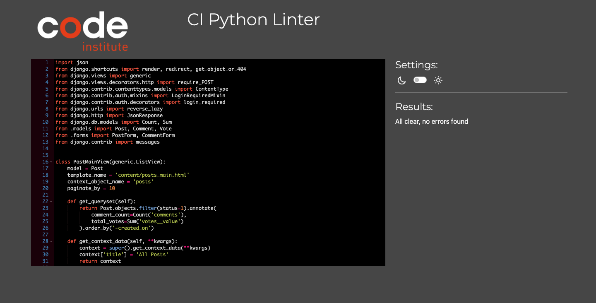

## Manual Testing against User Story acceptance:

| User Story | MoSCoW | Acceptance Criteria | Test Case ID | Test Steps | Expected Result | Actual Result | Pass/Fail |
|---|---|---|---|---|---|---|---|
| **User Features** | | | | | | | |
| User: Register for an account | Must Have | The user should be able to create an account with a unique username, email, and password. | TC1 | 1. Navigate to the registration page. 2. Fill in the required fields. 3. Submit the form. | A new user account should be created. | ... | ... |
| User: Log in and log out | Must Have | The user should be able to log in and log out of their account securely. | TC2 | 1. Navigate to the login page. 2. Enter valid credentials. 3. Click "Login." 4. Navigate to the logout page and click "Logout." | The user should be logged in and then logged out successfully. | ... | ... |
| User: Browse Tidders | Must Have | The user should be able to view a list of available Tidders and their descriptions. | TC3 | 1. Navigate to the homepage. 2. Click on the "Tidders" link. | A list of Tidders should be displayed. | ... | ... |
| User: View Posts in a Tidder | Must Have | The user should be able to view a list of posts within a Tidder, sorted by date or popularity. | TC4 | 1. Navigate to a specific Tidder. 2. Verify that posts are displayed in a clear and organized manner. | Posts should be displayed correctly. | ... | ... |
| User: View Post Details | Must Have | The user should be able to view the full content of a post, including its title, body, comments, and upvotes/downvotes. | TC5 | 1. Click on a specific post. 2. Verify that the post's title, content, and comments are displayed. | Post details should be displayed correctly. | ... | ... |
| User: Submit a Post | Must Have | The user should be able to submit a new text post, link post, or image post to a relevant Tidder. | TC6 | 1. Navigate to a Tidder. 2. Click the "Submit" button. 3. Fill in the post details. 4. Submit the post. | The new post should be displayed in the Tidder. | ... | ... |
| User: Comment on Posts | Must Have | The user should be able to post comments on posts and replies to other comments. | TC7 | 1. Navigate to a post. 2. Click the "Comment" button. 3. Fill in the comment box. 4. Submit the comment. | The comment should be displayed below the post. | ... | ... |
| User: Vote on Posts and Comments | Must Have | The user should be able to upvote or downvote posts and comments. | TC8 | 1. Navigate to a post or comment. 2. Click the upvote or downvote button. | The vote should be registered, and the vote count should update. | ... | ... |
| User: Edit and Delete Own Posts and Comments | Must Have | The user should be able to edit or delete their own posts and comments within a certain timeframe. | TC9, TC10 | 1. Navigate to a post or comment. 2. Click the "Edit" or "Delete" button. 3. Make necessary changes or confirm deletion. | The post or comment should be edited or deleted successfully. | ... | ... |
| User: Search for Content | Should Have | The user should be able to search for posts and comments using keywords or phrases. | TC11 | 1. Use the search bar to input a keyword. 2. Click the "Search" button. | Relevant search results should be displayed. | ... | ... |
| User: Follow Tidders | Could Have | The user should be able to follow specific Tidders to receive notifications about new posts. | TC12 | 1. Navigate to a Tidder. 2. Click the "Follow" button. | The user should receive notifications for new posts in the Tidder. | ... | ... |
| User: Save Posts and Comments | Could Have | The user should be able to save posts and comments for later reference. | TC13 | 1. Navigate to a post or comment. 2. Click the "Save" button. | The post or comment should be added to the user's saved items. | ... | ... |
| User: Report Abuse | Must Have | The user should be able to report abusive or inappropriate content. | TC14 | 1. Navigate to a post or comment. 2. Click the "Report" button. 3. Fill in the report form. 4. Submit the report. | The report should be submitted to the moderators. | ... | ... |

**Admin Features**

| Admin User Story | MoSCoW | Acceptance Criteria | Test Case ID | Test Steps | Expected Result | Actual Result | Pass/Fail |
|---|---|---|---|---|---|---|---|
| Admin: Create and Manage Tidders | Must Have | The admin should be able to create, edit, and delete Tidders. | TC15 | 1. Log in as admin. 2. Navigate to the admin panel. 3. Create a new Tidder. | The new Tidder should be created. | ... | ... |
| Admin: Moderate User Content | Must Have | The admin should be able to remove or edit inappropriate or harmful content. | TC16 | 1. Log in as admin. 2. Navigate to a post or comment. 3. Click the "Moderate" button. 4. Choose to remove or edit the content. | The content should be moderated accordingly. | ... | ... |
| Admin: Manage User Accounts | Must Have | The admin should be able to ban or suspend users who violate community guidelines. | TC17 | 1. Log in as admin. 2. Navigate to the user management section. 3. Select a user. 4. Choose to ban or suspend the user. | The user's account should be banned or suspended. | ... | ... |
| Admin: Monitor Site Activity | Must Have | The admin should be able to track user activity, identify trends, and troubleshoot issues. | TC18 | 1. Log in as admin. 2. Navigate to the admin dashboard. 3. View user activity logs and site statistics. | Relevant data should be displayed. | ... | ... |

## Accessibility testing

- Google Lighthouse audit reports an accessibility score of 87%, ensuring users with disabilities can access the site effectively.

## Browser and Device Testing

- Tested on multiple devices and browsers for responsiveness:
  - iPhone
  - Desktop
  - Chrome Developer Tools (simulating various devices)
  - Browsers: Chrome, Edge, and Safari
- Site functioned as expected across all tested platforms.

---

# Bugs

Bug 1 - An issue was found with the Nested comment section.

- Expectation - that reply comments nest only under their parent comments.

- Issue - reply comments would appear in duplicate, as both standalone comments without context and as nested-comments under their direct parent comment.

- Resolution - the View and Template page HTML were both edited to use a different structure, hiding any parent-less reply comment that appeared in the main comment thread.

---

Bug 2 - an issue was found with the uploaded Favicons.

- Expectation - that these would appear as expected for site visitors, in the browser tab.

- Issue - these did not load as expected and threw multiple errors into the Dev Tools Console.

- Resolution - the files were re-added after checking with an AI tool for additional troubleshooting, which fixed the issue and rendered the favicons as expected.

---

Bug 3 - an issue with the Add Comment and Edit comment button.

- Expectation - that these would act as expected, allowing users to easily submit and re-submit their content after editing.

- Issue - these did not load as expected and instead threw an Error page, halting the process completelty.

- Resolution - The issue was isolated to the View used to create and render the Comments. After troubleshooting this, the part of the View which handled user messages was edited and typos were removed, allowing the buttons to work as expected again.

# Deployment

**Deploying to Heroku**

The steps I took to deploy Django project to Heroku:

1. **Create a New App:**
   - Log in to your Heroku account and click "New App."
   - Choose a unique name for app.
   - Select  preferred region.
   - Click "Create App."

2. **Connect to GitHub:**
   - In the "Deploy" tab, select "GitHub."
   - Connect GitHub account and select the project repository.

3. **Configure Deployment:**
   - Choose manual to reserve depolyments and possible credit issues.
   - Ensure main branch is selected for deployment.

4. **Set Up Config Vars:**
   - In the "Settings" tab, click "Reveal Config Vars."
   - Add necessary environment variables, such as database credentials and API keys.

5. **Select Buildpacks:**
   - In the "Buildpacks" tab, add Node.js and Python buildpacks.

6. **Deploy:**
   - Click "Deploy Branch."
   - Once deployed, you can access your live app using the provided URL or pressing the 'open app' button.
---

# Future Enhancements:

- Give more time we would have completed a model for User Profile, and map this to a matching View.

User profiles, as seen in our wireframes and ERD diagramme above, would have allowed users to submit a Profile picture - which would be referenced in created Posts and Comments for a deeper sense of ownership and personality - and allowed users to submit Biographies for other users to learn more about them. 

- Comment Section searches

Given more time, we could have implemented a search function for the Comment section, to allow users to shift through long comment chains with greater ease or look for comments with specific words and phrases.

- Posts/ Comment section filtering

Given more time, we could have implement filtering, such as 'Newest First, 'Oldest First', 'Highest-scoring First' etc, to allow users more choice in how they navigate the site, and what content will be rendered for them first. 

# Credits

- **Bootstrap**: For layout, components, and responsive design.
- **Code Institute**: For project templates and guidance.
- **Font Awesome**: For icons used throughout project.
- **Perplexity.ai**: For troubleshooting and assistance with bug-hunting.
- **Favicon**: For favicon image.
- **Freepik**: For hero image.
